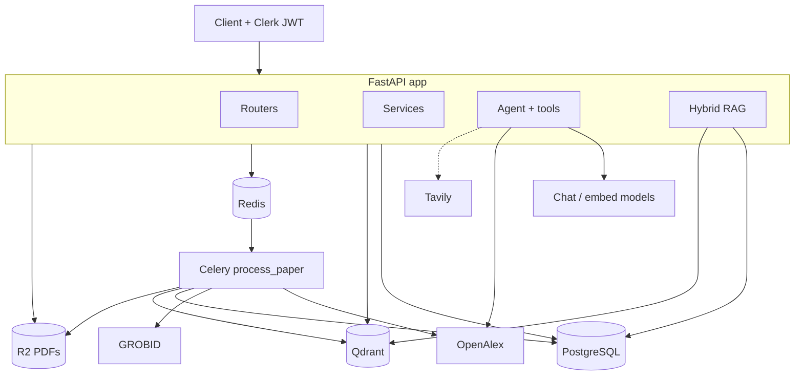
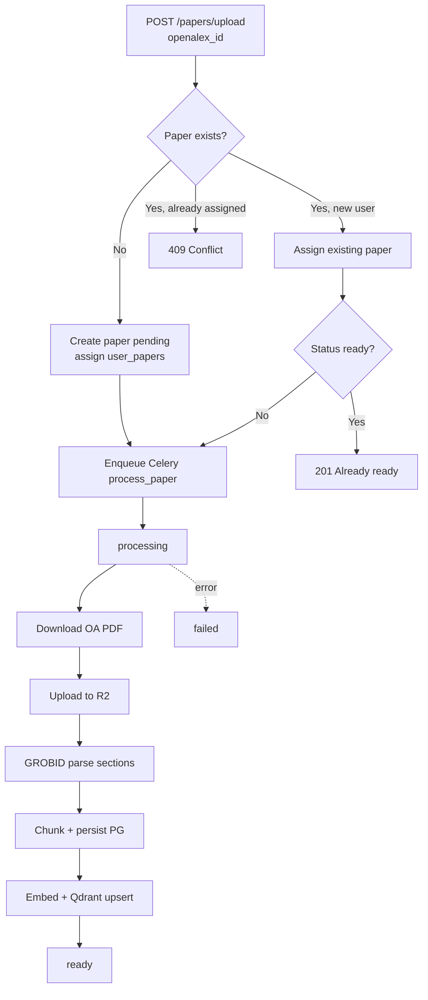
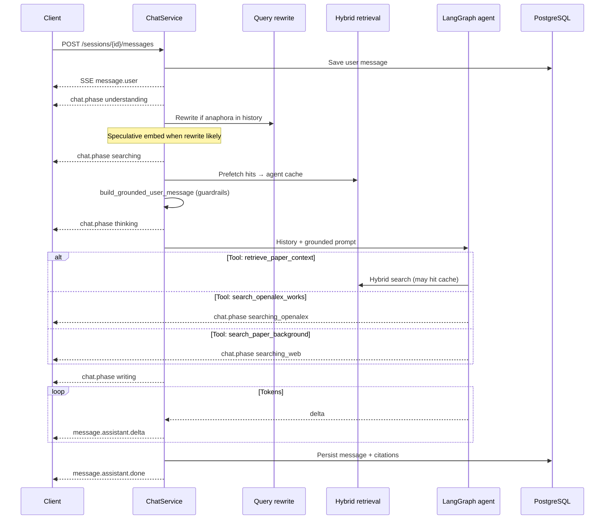
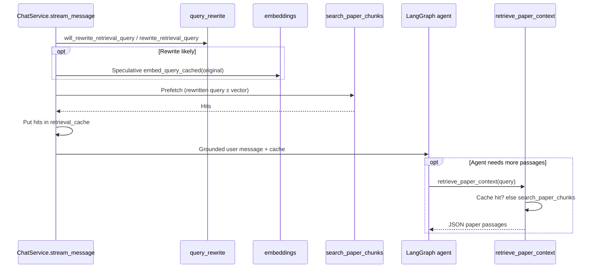
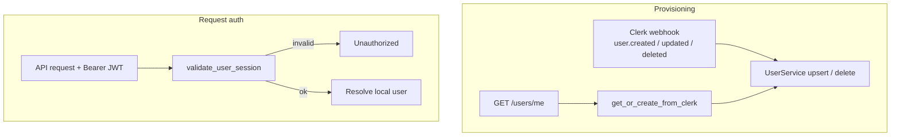
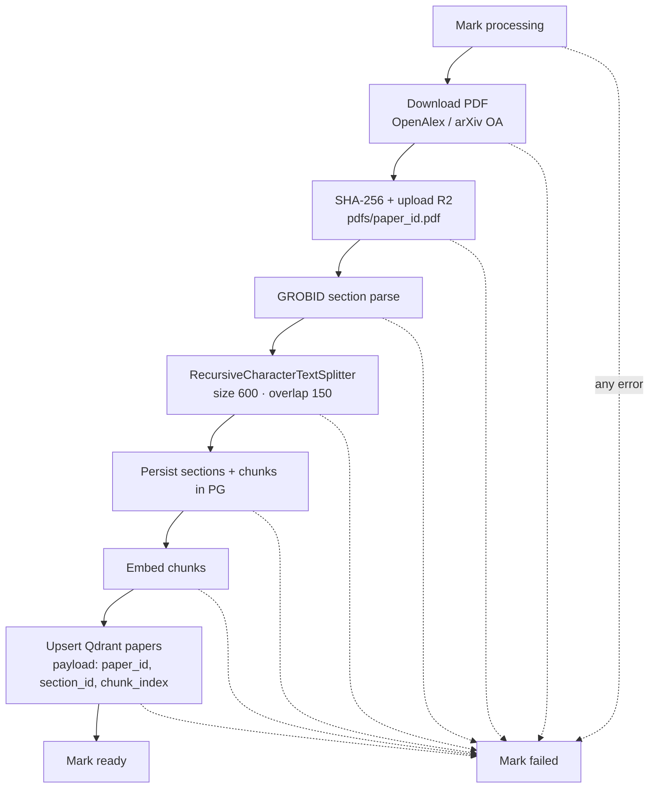
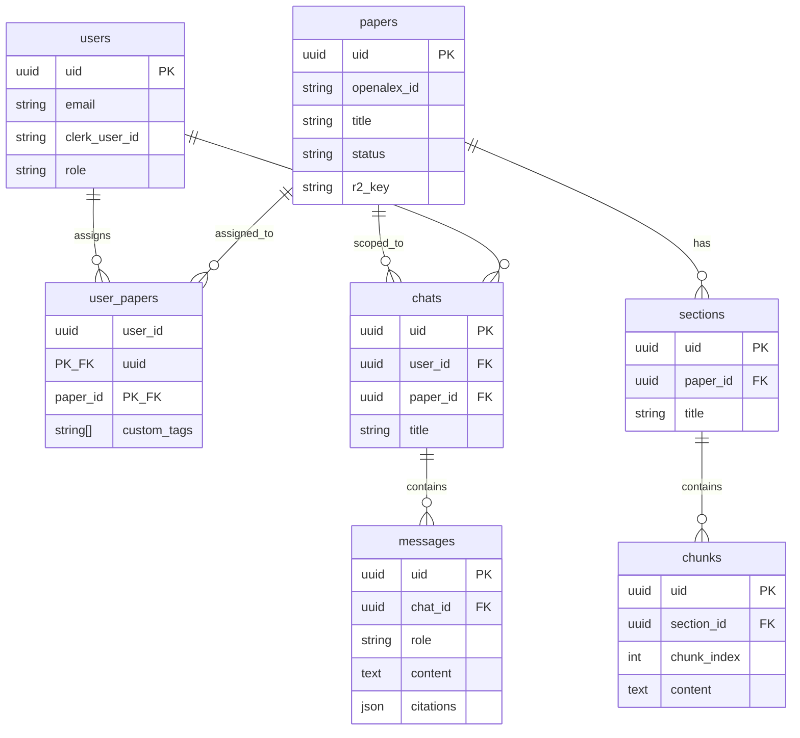

# Inquiro Backend

Inquiro is a RAG-based backend for analysing research papers. Users ingest papers by OpenAlex ID; the system fetches metadata and a PDF, parses the document, chunks it, embeds the text, and stores vectors for retrieval. Authenticated users can list papers, read PDFs, and chat with a LangGraph agent grounded in the attached paper.

For full-stack setup (Clerk, R2, PostgreSQL, frontend), see the [root README](../README.md).

## Current capabilities

- Health check at `GET /`
- Clerk webhooks for user create, update, and delete
- Lazy user provisioning via `GET /api/v1/users/me`
- Authenticated paper ingest from OpenAlex (`POST /api/v1/papers/upload`)
- Paper list with search, PDF stream, and signed PDF URL
- User library (`GET /api/v1/user-papers`)
- OpenAlex proxy for work search and detail (`/api/v1/openalex/works`)
- Chat sessions CRUD and streaming Q&A (`/api/v1/sessions`)
- Hybrid RAG (dense + keyword), optional query rewrite / LLM rerank, OpenAlex + optional Tavily tools
- Background processing: download PDF, upload to Cloudflare R2, parse with GROBID, chunk, embed, upsert into Qdrant
- Shared paper library plus per-user assignment (`user_papers`)
- Typed API errors via `InquiroError` handlers

Paper status flow: `pending` → `processing` → `ready` or `failed`.

## Stack

| Layer | Choice |
| --- | --- |
| API | FastAPI |
| Auth | Clerk (session tokens + Svix-signed webhooks) |
| Database | PostgreSQL via SQLModel / SQLAlchemy (async, `asyncpg`) |
| Migrations | Alembic |
| Queue | Celery + Redis |
| PDF storage | Cloudflare R2 (S3-compatible) |
| Metadata | [OpenAlex](https://openalex.org/) |
| PDF parsing | [GROBID](https://grobid.readthedocs.io/) |
| Chunking | LangChain `RecursiveCharacterTextSplitter` (size 600, overlap 150) |
| Embeddings | OpenAI-compatible API (`langchain-openai`) |
| Vectors | Qdrant collection `papers` (1024-dim, cosine) |
| Retrieval | Hybrid dense (Qdrant) + keyword (Postgres FTS), RRF, optional LLM rerank |
| Chat | LangGraph ReAct agent (`langgraph`, `langchain-openai`) |
| Scholarly search | OpenAlex tool (`search_openalex_works`) |
| Web search | Optional Tavily (`langchain-tavily`) for non-scholarly background |

## Architecture

### System overview



### Paper ingest



If the paper already exists, ingest assigns it to the current user instead of reprocessing. Assigning a paper the user already has returns a conflict.

### Chat / RAG



Scope guardrails in `src/agent/guardrails.py` restrict answers to the attached paper. Prefer OpenAlex for scholarly metadata (related work, citations, authors, venues). Use Tavily only for non-scholarly paper-related background (definitions or assumed context).

Citations on the assistant message are a JSON object with three buckets: `paper` (chunk excerpts), `openalex` (works), and `web` (URLs).

### Retrieval process

Hybrid retrieval is the paper-grounding path for chat. Entry point: `search_paper_chunks` in [`src/rag/retrieval.py`](src/rag/retrieval.py). Every search is **scoped to one `paper_id`** (Qdrant filter + Postgres join).

#### When it runs



1. **Prefetch** — Before the agent runs, chat rewrites (if needed), searches once, and injects passages into the grounded user prompt.
2. **Tool** — `retrieve_paper_context` searches again only when the agent needs more context; identical normalized queries reuse the prefetch cache.

#### Pipeline (`search_paper_chunks`)

```mermaid
flowchart TD
  In[Query string] --> Clean[Whitespace normalize]
  Clean --> Empty{Empty?}
  Empty -->|yes| None[Return]
  Empty -->|no| Recall

  subgraph Recall["Parallel recall — limit RAG_CANDIDATE_K"]
    Dense["_dense_search<br/>embed_query_cached → Qdrant cosine<br/>Filter: paper_id"]
    Key["_keyword_search<br/>plainto_tsquery + ts_rank_cd<br/>section.title ‖ chunk.content"]
  end

  Clean --> Dense
  Clean --> Key
  Dense --> RRF["reciprocal_rank_fusion<br/>score += 1 / (RAG_RRF_K + rank)"]
  Key --> RRF
  RRF --> Order[Sort by fused score · take candidate_k]
  Order --> Hydrate["_hydrate_chunks<br/>load text + section metadata from PG"]
  Hydrate --> Pref["_prefilter_hits<br/>drop below RAG_MIN_SCORE<br/>unless in top keyword IDs"]
  Pref --> Pool[Truncate to rerank pool<br/>min of RAG_RERANK_MAX_CANDIDATES,<br/>max(2×TOP_K, 12), CANDIDATE_K]
  Pool --> Rerank["rerank_hits listwise LLM<br/>or passthrough if disabled / local model"]
  Rerank --> Thr["_apply_rerank_threshold<br/>RAG_MIN_SCORE; fallback top 3"]
  Thr --> Primaries[Take RAG_TOP_K]
  Primaries --> Exp["_expand_neighbors<br/>± RAG_NEIGHBOR_WINDOW in section<br/>inherited score × 0.9"]
  Exp --> Dedup[_dedupe_hits]
  Dedup --> Out["_strip_internal_fields<br/>cap RAG_MAX_CONTEXT_CHUNKS"]
```

| Step | Module | Behavior |
| --- | --- | --- |
| Query rewrite | `will_rewrite_retrieval_query` / `rewrite_retrieval_query` in `src/rag/query_rewrite.py` | If `RAG_QUERY_REWRITE_ENABLED` and history has anaphora (`it`, `this`, `those`, …), LLM rewrites to a standalone paper search query |
| Speculative embed | `ChatService.stream_message` + `embed_query_cached` | When rewrite is likely, embed the original question in parallel; reuse the vector only if the rewritten query equals the original (`normalize_retrieval_query`) |
| Dense | `_dense_search` | `embed_query_cached` → Qdrant collection `papers` (cosine), must-match `paper_id` |
| Keyword | `_keyword_search` | English FTS via `plainto_tsquery` over `section.title + chunk.content`, ranked with `ts_rank_cd` |
| RRF | `reciprocal_rank_fusion` | Fuse dense + keyword ID rankings with constant `RAG_RRF_K` (default `60`) |
| Hydrate | `_hydrate_chunks` | Resolve chunk IDs to text, section title, and indices for prompting / citations |
| Prefilter | `_prefilter_hits` | Drop low fused scores (`RAG_MIN_SCORE`) while keeping strong keyword hits |
| Rerank | `rerank_hits` in `src/rag/rerank.py` | Listwise LLM reorder when `RAG_RERANK_ENABLED`; skipped for local/loopback chat models; falls back to input order on failure |
| Threshold | `_apply_rerank_threshold` | Re-apply `RAG_MIN_SCORE` after rerank; if everything is filtered, keep a small top fallback |
| Neighbors | `_expand_neighbors` | Add adjacent chunk indices in the same section (inherited score × `0.9`) so the model sees surrounding sentences |
| Cap | `_dedupe_hits` + `_strip_internal_fields` | Deduplicate, strip internal fields, truncate to `RAG_MAX_CONTEXT_CHUNKS` |

#### Tunables

| Variable | Default | Role |
| --- | --- | --- |
| `RAG_TOP_K` | `8` | Primary hits after rerank |
| `RAG_CANDIDATE_K` | `20` | Dense / keyword recall pool before fusion |
| `RAG_MIN_SCORE` | `0.15` | Floor after fusion / rerank |
| `RAG_RRF_K` | `60` | Reciprocal-rank fusion constant |
| `RAG_NEIGHBOR_WINDOW` | `1` | Adjacent chunks on each side |
| `RAG_RERANK_ENABLED` | `true` | Listwise LLM rerank |
| `RAG_RERANK_MAX_CANDIDATES` | `15` | Max passages sent to the reranker |
| `RAG_MAX_CONTEXT_CHUNKS` | `12` | Hard cap after neighbor expansion |
| `RAG_QUERY_REWRITE_ENABLED` | `true` | Conversational query rewrite |
| `RAG_EMBED_CACHE_SIZE` | `256` | In-process embedding cache size |

SSE event types:

| Event | Payload |
| --- | --- |
| `message.user` | Saved user message |
| `chat.phase` | `{ "phase": "understanding\|searching\|thinking\|searching_openalex\|searching_web\|writing", "label": "..." }` status before/during generation |
| `message.assistant.delta` | `{ "delta": "..." }` streaming token |
| `message.assistant.done` | Full assistant message with `citations: { paper, openalex, web }` |
| `error` | `{ "detail": "..." }` |

### Auth



## Project layout

```
src/
  __init__.py              # FastAPI app, routers, error handlers
  config/main.py           # Settings from .env
  db/                      # Engine, session, SQLModel tables
  errors/                  # InquiroError types and HTTP handlers
  agent/                   # LangGraph agent, tools, guardrails
  routers/                 # papers, sessions, user-papers, users, openalex, webhooks
  schemas/                 # Request/response models
  services/                # Papers, sessions, chat, users, sections, chunks
  rag/                     # Chunker, embeddings, Qdrant, hybrid retrieval, rewrite, rerank
  utils/                   # Clerk, OpenAlex, GROBID, R2, PDF
  worker/                  # Celery app and process_paper task
  docker_compose/
    backend/               # Redis + Qdrant
    grobid/                # GROBID 0.9.0
alembic/                   # Database migrations
```

## Prerequisites

- Python 3.11+
- Docker (Redis, Qdrant, GROBID)
- PostgreSQL (external — see [root README](../README.md))
- Clerk application (API keys + webhook signing secret)
- Cloudflare R2 bucket
- OpenAlex API key (optional but recommended)
- OpenAI-compatible embeddings endpoint (1024-dimensional vectors) and chat model
- Tavily API key (optional)

## Setup

1. Create and activate a virtual environment.

```bash
python -m venv .venv
# Windows
.venv\Scripts\activate
# macOS / Linux
source .venv/bin/activate
```

2. Install dependencies.

```bash
pip install -r requirements.txt
```

3. Copy environment variables and fill in secrets.

```bash
cp .env.example .env
```

4. Start local infrastructure.

```bash
poe start_docker_compose_backend   # Redis :6379, Qdrant :6333
poe start_docker_compose_grobid    # GROBID :8070
```

5. Run migrations.

```bash
alembic upgrade head
```

6. Start the API and worker (separate terminals).

```bash
poe start          # uvicorn src:app --reload  (default http://localhost:8000)
poe start_celery   # Celery worker (solo pool)
```

Optional: `poe start_flower` for Celery Flower.

## Environment variables

Defined in `.env.example` and loaded by `src/config/main.py`:

| Variable | Purpose |
| --- | --- |
| `POSTGRESQL_URL` | Async SQLAlchemy URL (e.g. `postgresql+asyncpg://...`) |
| `CLERK_SIGNING_SECRET` | Svix secret for `/api/v1/webhooks/clerk` |
| `CLERK_PUBLISHABLE_KEY` | Clerk publishable key |
| `CLERK_SECRET_KEY` | Clerk secret key (session validation) |
| `R2_ACCOUNT_ID` / `R2_ACCESS_KEY` / `R2_SECRET_ACCESS_KEY` | Cloudflare R2 credentials |
| `R2_BUCKET` | Bucket name (default `inquiro`) |
| `OPEN_ALEX_API_KEY` | OpenAlex API key in `.env.example`; runtime expects `OPEN_ALEX_KEY` (field `open_alex_key`) |
| `GROBID_URL` | GROBID base URL (default `http://localhost:8070/`) |
| `EMBEDDING_MODEL` | Embedding model name |
| `CHAT_MODEL` | Chat model for the agent |
| `REWRITE_MODEL` | Optional rewrite model (falls back to `CHAT_MODEL`) |
| `AI_API_KEY` / `AI_BASE_URL` | OpenAI-compatible client |
| `REWRITE_AI_BASE_URL` | Optional rewrite endpoint (falls back to `AI_BASE_URL`) |
| `TAVILY_API_KEY` | Optional; enables non-scholarly web search tool in chat |
| `RAG_TOP_K` | Final chunk count after rerank (default `8`) |
| `RAG_CANDIDATE_K` | Dense/keyword recall pool before RRF (default `20`) |
| `RAG_MIN_SCORE` | Score floor after fusion/rerank (default `0.15`) |
| `RAG_RRF_K` | Reciprocal-rank fusion constant (default `60`) |
| `RAG_NEIGHBOR_WINDOW` | Adjacent chunk expansion (default `1`) |
| `RAG_RERANK_ENABLED` | LLM listwise rerank (default `true`) |
| `RAG_RERANK_MAX_CANDIDATES` | Max passages for reranker (default `15`) |
| `RAG_MAX_CONTEXT_CHUNKS` | Cap after neighbor expansion (default `12`) |
| `RAG_QUERY_REWRITE_ENABLED` | Conversational query rewrite (default `true`) |
| `RAG_EMBED_CACHE_SIZE` | In-process embedding cache size (default `256`) |
| `QDRANT_URL` | Qdrant HTTP URL (default `http://localhost:6333`) |
| `CORS_ORIGINS` | JSON list of allowed frontend origins |

`REDIS_URL` defaults to `redis://localhost:6379/0` if unset. Qdrant collection `papers` is created on first import of the vector store if it does not exist.

## API

Base prefix: `/api/v1`. Interactive docs: `/docs`.

All authenticated routes expect:

```http
Authorization: Bearer <Clerk session token>
```

### Health

| Method | Path | Description |
| --- | --- | --- |
| GET | `/` | `{ "status": "ok", "version": "v1" }` |

### Users

| Method | Path | Description |
| --- | --- | --- |
| GET | `/api/v1/users/me` | Current user profile; creates local user from Clerk if missing |

### Papers

| Method | Path | Description |
| --- | --- | --- |
| GET | `/api/v1/papers` | List papers for the user (search, pagination) |
| POST | `/api/v1/papers/upload` | Ingest by OpenAlex ID |
| GET | `/api/v1/papers/{paper_id}/pdf` | Stream PDF inline |
| GET | `/api/v1/papers/{paper_id}/pdf-url` | Signed URL + paper metadata |

**Upload**

```http
POST /api/v1/papers/upload
Content-Type: application/json

{ "openalex_id": "W2741809807" }
```

- **201** — paper ready (already processed)
- **202** — paper queued for processing
- **404** — user or OpenAlex work not found
- **409** — paper already assigned to this user

### User papers (library)

| Method | Path | Description |
| --- | --- | --- |
| GET | `/api/v1/user-papers` | User's assigned papers (search, pagination) |

### OpenAlex proxy

| Method | Path | Description |
| --- | --- | --- |
| GET | `/api/v1/openalex/works` | Search works (filters: open access, year range, sort, cursor) |
| GET | `/api/v1/openalex/works/{work_id}` | Work detail; includes ingest status if already in DB |

### Sessions (chat)

| Method | Path | Description |
| --- | --- | --- |
| POST | `/api/v1/sessions` | Create session for a paper (`{ "paper_id": "..." }`) |
| GET | `/api/v1/sessions` | List sessions (pagination) |
| GET | `/api/v1/sessions/{session_id}` | Session detail with message history |
| PATCH | `/api/v1/sessions/{session_id}` | Update title |
| DELETE | `/api/v1/sessions/{session_id}` | Delete session |
| POST | `/api/v1/sessions/{session_id}/messages` | Send message; returns **SSE** stream |

**Send message**

```http
POST /api/v1/sessions/{session_id}/messages
Content-Type: application/json

{ "content": "What method did the authors use?" }
```

Response: `text/event-stream` with events listed in [Chat / RAG](#chat--rag).

### Clerk webhooks

```http
POST /api/v1/webhooks/clerk
```

Verified with the Clerk signing secret. Supported events:

- `user.created` / `user.updated` — upsert local user
- `user.deleted` — delete local user

Configure the webhook URL in the Clerk dashboard. For local dev, use a tunnel so Clerk can reach your machine.

## Paper processing pipeline

Celery task `process_paper` (`src/worker/process_paper.py`):



1. Mark paper `processing`
2. Download PDF from OpenAlex / arXiv OA URLs
3. SHA-256 hash the file and upload to R2 at `pdfs/{paper_id}.pdf`
4. Parse sections with GROBID
5. Split each section into overlapping chunks
6. Persist `sections` and `chunks` in PostgreSQL
7. Embed chunk text and upsert points into Qdrant (`papers`), payload: `paper_id`, `section_id`, `chunk_index`
8. Mark paper `ready`, or `failed` on error

## Data model (high level)



| Table | Role |
| --- | --- |
| `users` | Local users linked to Clerk |
| `papers` | Canonical paper (OpenAlex ID, DOI, status, R2 key) |
| `user_papers` | User ↔ paper assignment and tags |
| `sections` / `chunks` | Parsed structure used for RAG |
| `chats` / `messages` | Chat sessions and Q&A history with citations |

## Common commands

| Command | What it does |
| --- | --- |
| `poe start` | API with reload |
| `poe start_celery` | Celery worker |
| `poe start_flower` | Flower UI |
| `poe start_docker_compose_backend` | Redis + Qdrant |
| `poe start_docker_compose_grobid` | GROBID |
| `poe stop_docker_compose_backend` | Stop Redis + Qdrant |
| `poe stop_docker_compose_grobid` | Stop GROBID |
| `poe migrate "<message>"` | Autogenerate an Alembic revision |
