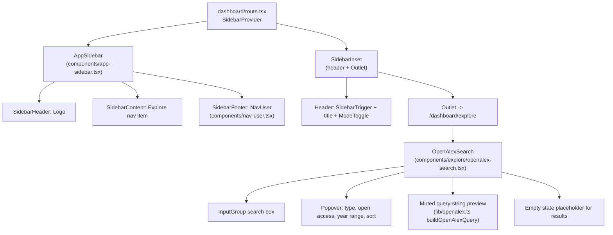

# Dashboard Sidebar Layout + OpenAlex Search UI

## Scope confirmed with user
- Search bar is UI-only for this pass: it builds/previews an OpenAlex-style query from filter state, but does not call the live API yet (follow-up work).
- shadcn components to install (user will run this):

```bash
npx shadcn@latest add sidebar avatar input input-group select popover label tooltip toggle-group field empty
```

Already available and reused: `button`, `separator`, `sheet`, `skeleton`, `badge`, `dropdown-menu`.

Note: `npx shadcn info` failed in this environment with `self-signed certificate in certificate chain` (corporate network TLS inspection). If `add` hits the same error, retry with `$env:NODE_TLS_REJECT_UNAUTHORIZED=0; npx shadcn@latest add ...` (PowerShell) for that one command only.

## Layout structure



## Files to add

- `src/components/app-sidebar.tsx` — `Sidebar collapsible="icon"`: `SidebarHeader` (Logo), `SidebarContent` with one `SidebarGroup`/`SidebarMenu` item "Explore" (Compass icon, active state via `useRouterState`), `SidebarFooter` (`NavUser`), `SidebarRail`.
- `src/components/nav-user.tsx` — Uses `useUser()` / `useClerk()` from `@clerk/tanstack-react-start` (confirmed re-exported from `@clerk/react`). `SidebarMenuButton size="lg"` trigger with `Avatar` (imageUrl/initials fallback) + name + email + `ChevronsUpDown`, wrapped in existing `DropdownMenu`. Dropdown shows user info block + separator + "Log out" item (`LogOut` icon) calling `signOut()` then navigating to `/`. Shows `Skeleton` while `!isLoaded`.
- `src/lib/openalex.ts` — Types + constants for filters (`WORK_TYPES`, `SORT_OPTIONS`) and a pure `buildOpenAlexQuery(filters)` helper returning the query params OpenAlex would receive (`search`, `filter`, `sort`). No network calls; used only to power the query preview and to be ready for real integration later.
- `src/components/explore/openalex-search.tsx` — The search/filter UI:
  - `InputGroup` with search icon + text input + submit `Button`.
  - "Filters" `Popover` trigger (`SlidersHorizontal` icon, `Badge` showing active filter count) containing a `FieldGroup`/`Field` layout: work type `Select`, open access `ToggleGroup` (Any/Open/Closed), From/To year, sort `Select`; footer with Reset/Apply.
  - Removable filter chips (`Badge`) below the bar reflecting applied filters.
  - Muted monospace query preview line built from `buildOpenAlexQuery`.
  - `Empty` component placeholder ("Search OpenAlex to get started") where results will render in a follow-up.

## Files to modify

- `src/routes/dashboard/route.tsx` — Replace the bare `<div><Outlet /></div>` with `SidebarProvider` > `AppSidebar` + `SidebarInset` (header containing `SidebarTrigger`, vertical `Separator`, page title, `ModeToggle` on the right) wrapping `Outlet`.
- `src/routes/dashboard/explore/index.tsx` — Render `OpenAlexSearch` inside a padded content container.
- `src/routes/dashboard/index.tsx` — `beforeLoad` throws a `redirect` to `/dashboard/explore` (sidebar only exposes Explore for now, so `/dashboard` shouldn't dead-end on a placeholder).

## Notes
- Auth guard stub (`requireAuth`/`requireGuest` early `return true` in `src/lib/auth.ts`) is left as-is — out of scope for this task. `NavUser` reads the Clerk client hooks directly so it works independently of that guard.
- Follows shadcn skill rules: `Field`/`FieldGroup` for the filter form, `ToggleGroup` for the 3-way OA choice, `gap-*` not `space-y-*`, semantic color tokens, `Empty` for the placeholder results area, icons via `data-icon` inside buttons.
