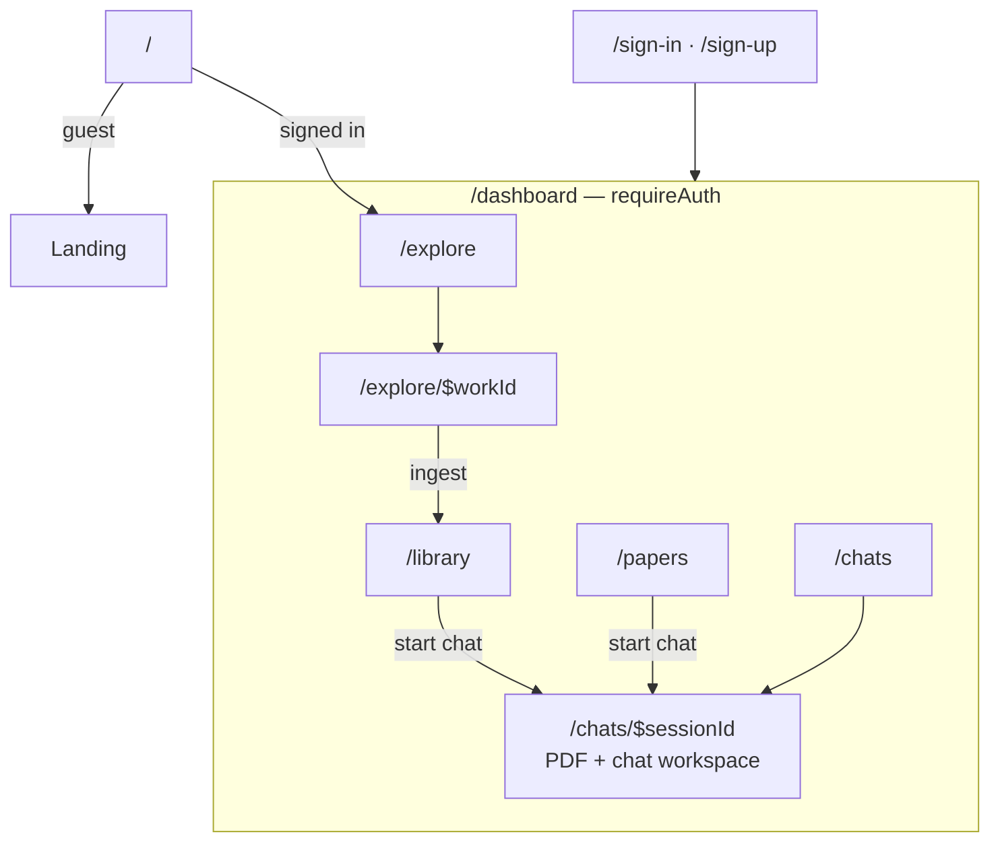
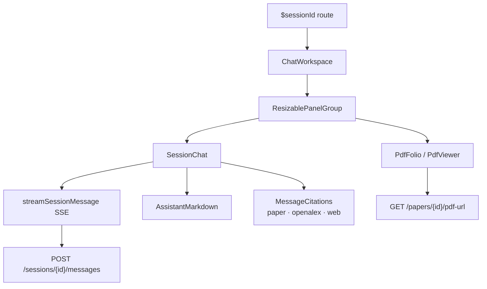
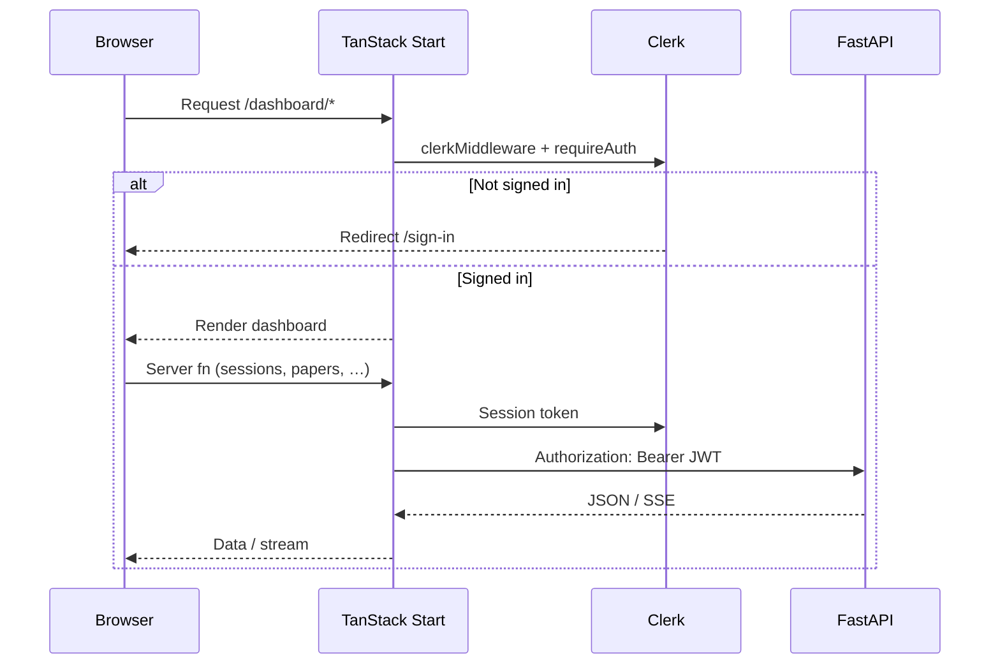

# Inquiro Frontend

TanStack Start application for Inquiro — explore research papers, manage your library, and chat with papers beside an inline PDF viewer.

For full-stack setup (PostgreSQL, backend, Clerk, R2), see the [root README](../README.md).

## What it does

- **Landing** — Marketing page for guests; redirects signed-in users to Explore
- **Dashboard** — Sidebar shell with Explore, Library, Papers, and Chats
- **Chat workspace** — Resizable split view: PDF on one side, streaming markdown chat with paper / OpenAlex / web citations on the other
- **OpenAlex search** — Find works, view details, ingest papers into the backend

## Routes



| Route | Access | Purpose |
| --- | --- | --- |
| `/` | Guest | Landing page |
| `/sign-in`, `/sign-up` | Public | Clerk authentication |
| `/dashboard/explore` | Auth | Search OpenAlex works |
| `/dashboard/explore/$workId` | Auth | Work detail and ingest |
| `/dashboard/library` | Auth | User paper library |
| `/dashboard/papers` | Auth | Global papers catalog |
| `/dashboard/chats` | Auth | Chat session list |
| `/dashboard/chats/$sessionId` | Auth | Chat + PDF workspace |

Routes live under `src/routes/` using TanStack Router file-based routing.

## Key modules

| Module | Role |
| --- | --- |
| [`src/lib/api.ts`](src/lib/api.ts) | Axios client, `apiFetch`, `getApiBaseUrl` |
| [`src/lib/sessions.ts`](src/lib/sessions.ts) | Session CRUD, SSE streaming (`streamSessionMessage`), TanStack Query options |
| [`src/lib/papers.ts`](src/lib/papers.ts) | Paper list, upload, PDF URL queries |
| [`src/lib/openalex.ts`](src/lib/openalex.ts) | OpenAlex search types and helpers |
| [`src/lib/auth.ts`](src/lib/auth.ts) | `requireAuth` / `requireGuest` server functions |
| [`src/lib/me.ts`](src/lib/me.ts) | Current user profile from backend |

### Chat workspace



Chat UI components: `src/components/chats/` (`chat-workspace`, `session-chat`, `assistant-markdown`, `message-citations`, `pdf-folio`, `pdf-viewer`).

Assistant messages expose structured citations (`paper`, `openalex`, `web`) via `parseMessageCitations` in `sessions.ts`. The Sources panel in `message-citations.tsx` links OpenAlex works into Explore when an ID is present.

## Auth



- [`src/start.ts`](src/start.ts) registers `clerkMiddleware()` on every server request
- Dashboard routes call `requireAuth` in `beforeLoad` ([`src/routes/dashboard/route.tsx`](src/routes/dashboard/route.tsx))
- Landing calls `requireGuest` and redirects authenticated users to Explore
- API calls attach the Clerk session token as `Authorization: Bearer ...` via server functions in `sessions.ts` and related modules

Server-side auth checks are the security boundary; client-only UI gates are for presentation.

## Setup

1. Ensure the [backend](../backend/README.md) is running at the URL you configure below.

2. Install dependencies:

```bash
npm install
```

3. Copy environment variables:

```bash
cp .env.example .env.local
```

4. Edit `.env.local`:

```bash
VITE_API_BASE_URL=http://127.0.0.1:8000
VITE_CLERK_PUBLISHABLE_KEY=pk_test_...
CLERK_SECRET_KEY=sk_test_...
```

`VITE_API_BASE_URL` must match the backend origin (including scheme and port). CORS on the backend defaults to `http://localhost:3000` and `http://127.0.0.1:3000`.

5. Start the dev server:

```bash
npm run dev
```

App: http://localhost:3000

## Scripts

| Script | Command | Purpose |
| --- | --- | --- |
| Dev | `npm run dev` | Vite dev server on port 3000 |
| Build | `npm run build` | Production build |
| Preview | `npm run preview` | Preview production build |
| Lint | `npm run lint` | ESLint |
| Format | `npm run format` | Prettier + ESLint fix |
| Check | `npm run check` | Prettier check only |
| Routes | `npm run generate-routes` | Regenerate TanStack Router route tree |

## Tech stack

| Layer | Choice |
| --- | --- |
| Framework | TanStack Start (React 19, Vite, Nitro) |
| Routing | TanStack Router (file-based) |
| Data | TanStack Query |
| Auth | Clerk |
| UI | shadcn/ui, Tailwind CSS 4 |
| PDF | pdfjs-dist |
| Markdown | react-markdown, remark-gfm, rehype-sanitize |

## Styling

Tailwind CSS 4 via `@tailwindcss/vite`. Global styles in `src/styles.css`. Theme toggle via `next-themes` (`ModeToggle` in the dashboard header).

## Production build

```bash
npm run build
node dist/server/index.mjs
```

The build output is a self-contained Node server (Nitro). For host-specific deployment presets, see [Nitro deploy docs](https://v3.nitro.build/deploy).

## Further reading

- [Root README](../README.md) — architecture, full-stack setup, environment variables
- [Backend README](../backend/README.md) — API reference and paper pipeline
- [TanStack Start docs](https://tanstack.com/start)
- [Clerk TanStack Start docs](https://clerk.com/docs/tanstack-react-start/getting-started/quickstart)
